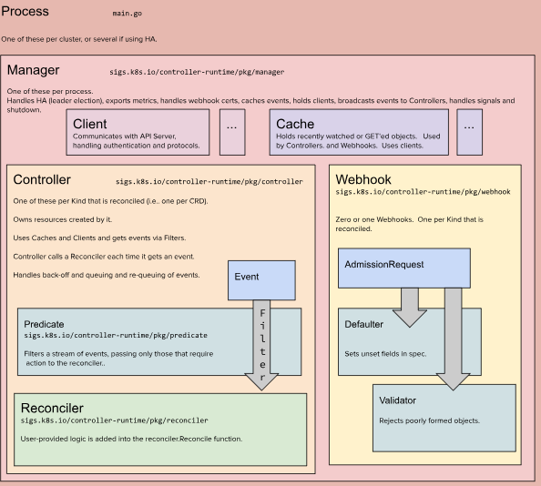
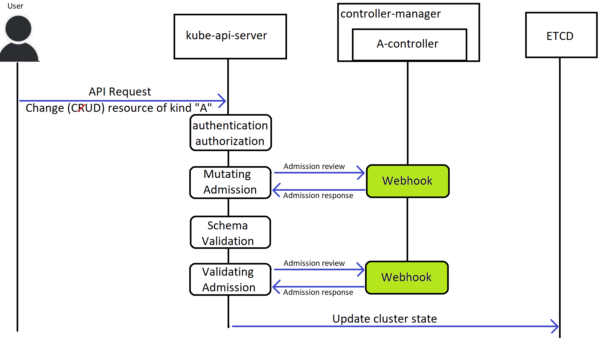
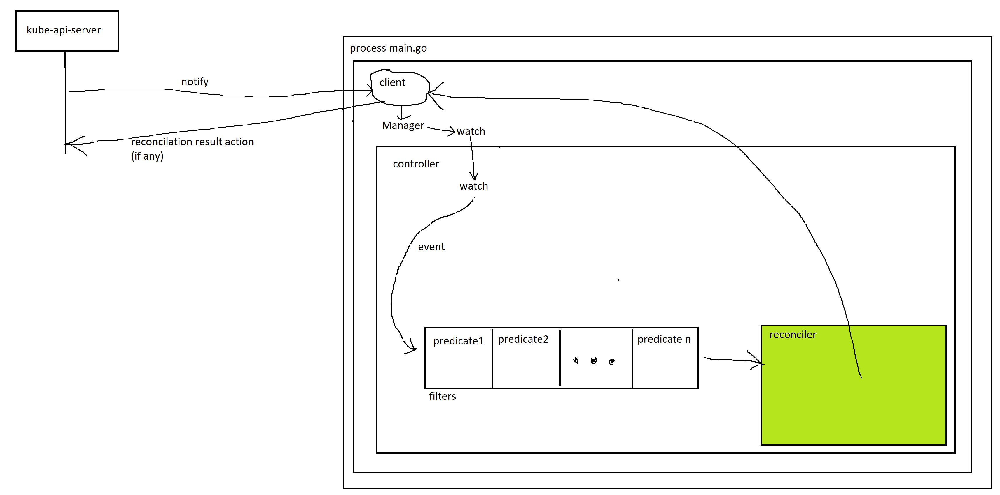

# What is Kubebuilder

https://book.kubebuilder.io/introduction

Kubebuilder is an open-source framework for building Kubernetes APIs using custom controllers. Developed by the Kubernetes community, it helps developers create Kubernetes custom resources and controllers by providing abstractions and utilities to simplify the process. Kubebuilder is built on top of the [controller-runtime](https://pkg.go.dev/sigs.k8s.io/controller-runtime) library and is part of the Kubernetes [SIG API Machinery](https://github.com/kubernetes/community/tree/master/sig-api-machinery).

Kubebuilder is particularly helpful for those who want to extend Kubernetes by creating their own operators or custom resources. It provides scaffolding to generate boilerplate code and follows Kubernetes conventions, making it easier to create projects that integrate well with Kubernetes.

Using Kubebuilder, developers can:

1. **Define Custom Resources (CRDs)**: Define new types in Kubernetes, known as Custom Resource Definitions, which allow you to extend Kubernetes with your own API resources.
2. **Generate Boilerplate Code**: Automatically generate code that is needed for controllers, such as client sets and informers.
3. **Implement Controllers**: Write the logic that watches for changes to Kubernetes resources and acts on them.

Kubebuilder is suitable for both beginners and experienced Kubernetes developers, as it significantly speeds up the development of Kubernetes-native applications. It's often used in combination with tools like Helm and Operator SDK to build Kubernetes operators. 

For more details, you can visit [Kubebuilder's official documentation](https://book.kubebuilder.io/).

# Architecture

https://book.kubebuilder.io/architecture

Here we should start with the concept of Controller Pattern: https://kubernetes.io/docs/concepts/architecture/controller/


In the K8s cluster architecture we have a `kube-controller-manager`. It is a process that has **controller** for all built-in resources (such as Nodes, Pods, Replication Controllers, Deployments, Services, Endpoints... etc...).

The controllers of built-in resources are developed by Kubernetes Team and do not use any framework like [controller-runtime](https://github.com/kubernetes-sigs/controller-runtime). They are build directly on top of Kubernetes APIs, and are highly optimized and customized for handling core Kubernetes resources.

Controllers for native, built-in resources run in a single process of `kube-controller-manager`. The controllers for custom resources (we call such controllers - operators) run outside of a `kube-controller-manager` typically user deploys them in a separate pod.

Operators are controller for user defined resources (custom resources). We define them with **Custom Resource Definitions**. More can be found here: https://github.com/0x41gawor/pdmgr/blob/master/crd-playground-lab.md

Let's dive into architecture of Kubebuilder:



## Process

`main.go`

This is the main entry point of the operator or controller. Typically, there is one of these per cluster or multiple if using high availability (HA). 
This process typically runs in a pod deployed by user.

## Manager

https://pkg.go.dev/sigs.k8s.io/controller-runtime/pkg/manager

There is one Manager per process. The **Manager** is responsible for setting up dependencies and managing the lifecycle of controllers and webhooks. 

> It is worth to add that single process can have multiple controllers inside, can control multiple custom resources.

Manager also:
- Handles leader election.
    - In HA (High availability) you might run multiple replicas of a controller for reliability and high availability. Leader election ensures that ONLY ONE INSTANCE of the controller process is actively reconciling the resources at any given time, preventing multiple controllers from making conflicting changes to the cluster.
- Exports metrics 
    - It provides observability metrics to help monitor the performance and health of controllers. These metrics are usually exported in a format that can be scraped by monitoring systems such as [Prometheus](https://prometheus.io). E.g. these metrics are
        - Reconciliation performance: e.g. how long the reconcile process take, and whether there are any failures. For example, metrics like `controller_runtime_reconcile_total` (count of reconcile events) and `controller_runtime_reconcile_errors_total` (count of reconcile errors).
- Manages webhook certificates
    - [What is webhook](webhook.md)
    - Webhooks require HTTPS and Manager can automatically generate and manage TLS certificates. Manager abstracts the complexity of certificate creation, renewal and usage.
- Caches events and clients.
    - We will learn later what is **Event** and **Client**. Manager just manages them.
- Broadcasts events to controllers.
    1. Events originate from Kubernetes resources, such as Pod being created, updated, or deleted. These events are generated by `kube-api-server`.
    2. Manager typically registers interest in specific resources and sets up **watches**. A watch essentially is a subscription that allows it to be notified whenever event related to resources it's interested in occurs.
    3. When event occurs Manager receives it.
    4. Instead of each controller independently communicating with the `kube-api-server`, the Manager is a central hub for event distribution. It maintains **informers** and **caches** of the resources and notifies controllers when changes are detected.
    5. The Manager uses caches to store the current state of resources, which helps controllers process events without making repeated API calls directly, improving performance.
    6. The controller get notified when there is a relevant event that they need to reconcile.

### Client
One per Manager.

The Client communicates with the Kubernetes API server (`kube-api-server`) to handle authentication and various operations on resources.

### Cache 
One per Manager.

The Cache stores recently watched or fetched objects to improve efficiency. It is used by controllers and webhooks to avoid frequent calls to the API server.

## Controller
Manager can manage multiple controllers. One per kind that is reconciled (i.e. one per CRD (Custom Resource Definition))

https://pkg.go.dev/sigs.k8s.io/controller-runtime#hdr-Controllers 

The **Controller** is responsible for reconciling one type (kind) of resource. One controller for one type. Types are defined with **Custom Resource Definitions**.

The controller manages the resources it owns by using Caches and Clients to watch and receive Events related to those resources.

When an event is received, it passes through Predicates, which filter out unnecessary events before being sent to the Reconciler.

### Predicate

https://pkg.go.dev/sigs.k8s.io/controller-runtime/pkg/predicate

Not every event that controller gets mean that resource needs to be reconcile. 

**Predicate** is used to filter a stream of events to ensure that only relevant events are passed to the Reconciler. This reduces unnecessary reconcile operations, making the controller more efficient.

Predicate consists of conditions that evaluate an event. These conditions can include:
- Checking if specific fields in resource have changed (e.f. the status field)
- Evaluate if the type of event (Update, Create, Delete or Generic event)
- Looking at resource labels or annotations to determine if the resource matches a certain criterion.

If the event:
- matches the predicate conditions -> it is passed to reconciler
- does not meet the conditions -> it gets rejected

### Reconciler
One per Kind (CRD).

https://pkg.go.dev/sigs.k8s.io/controller-runtime/pkg/reconcile

The **Reconciler** contains the core logic of the controller. It is where the business logic is implemented to ensure that the state of the cluster matches the desired state defined by the custom resource.

The **Reconciler** function will be invoked each time a relevant event occurs, and its job is to bring the actual state closer to the desired state.

## Webhook

One or zero per kind.

https://pkg.go.dev/sigs.k8s.io/controller-runtime/pkg/webhook

As you can learn in [What is webhook](webhook.md) `kube-api-server` calls Admission webhooks (mutating admission and validating admission) when API request related to some kind comes to it.

Here is the place when you can code the logic of this webhooks for your kind (Custom Resource).

### Defaulter

This is the code that is called on Mutating Admission Webhook.

Here you can modify the resource before it is stored in etcd, such as adding default values to fields that the user did not set.

### Validator

This is the code that is called on Validating Amission Webhook.

Here you can check if the resource configuration complies with certain rules or constraints, and can deny a request if it does not.


# Flow of events
Let us take a look again at Kubernetes Cluster Architecture.

As we know [Kubernetes](https://kubernetes.io) also known as K8s, is an open source system for automating deployment, scaling, and management of containerized applications. So all K8s is about are containers. Containers are run by container runtime (e.g. Docker, containerd, CRI-O, runc, Podman). All of the purpose of K8s revolves around containers. Containers itself, exposing their services, managing their volumes etc..

When user makes some changes in a cluster via API (e.g. via kubectl (which actually makes a HTTP call to kube-api-server underneath)) the final, eventual, ultimate result is to do smth around containers. Let's take a creation of a Pod as example. The ultimate result of this action beneath change in cluster state (reflected in etcd) is to run a specific container.

Which K8s element does it? Who talks with container-runtime? It is [kubelet](https://kubernetes.io/docs/reference/command-line-tools-reference/kubelet/)


kubelet resides on every node and talks with container-runtime on that node

Before description of the Flow of events related to kubebuilder, first let's take a look at this simplified and general scenario that pertains a k8s built-in resource.


In general this is what happens. Now, before we dive deeper, let us recognize kubebuilder related stages from this big picture flow.

If this scenario was pertaining user defined Custom Resource:


So as you can see we have control over the code of two aspects here:
- webhooks
- reconciler

## Flow of webhooks
Let's assume we are developing Custom Resource of Kind "A". 



The place where we can paste in our code is marked with green color

## Flow of reconcilation
Let's assume we are developing Custom Resource of Kind "B"



The things you can actually code are marked with green color.

This is "fast" diagram. More detailed one will be designed where more hands-on knowledge will be obtained.

# Quick start
https://book.kubebuilder.io/quick-start

This Quick Start guide will cover:
- Creating a project -> setting up kubebuilder boilerplate code
- Creating an API -> [What does it mean](creating-an-api.md)
- Running locally
- Running in-cluster

## Installation
```sh
# download kubebuilder and install locally.
curl -L -o kubebuilder "https://go.kubebuilder.io/dl/latest/$(go env GOOS)/$(go env GOARCH)"
chmod +x kubebuilder && sudo mv kubebuilder /usr/local/bin/
```
## Create a project
```sh
mkdir -p ~/projects/guestbook
cd ~/projects/guestbook
kubebuilder init --domain my.domain --repo my.domain/guestbook
```

It resulted with such directory/files structure:
