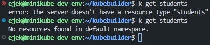
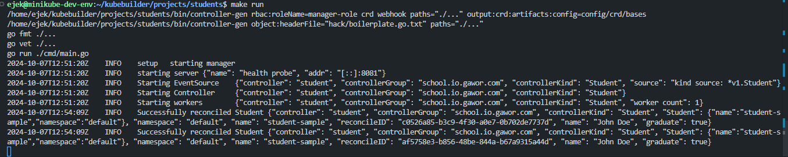

# My quick start

This document will be the repetition of [quick-start.md](quick-start.md) but on my own example and without any theory only the description of what I want to achieve and commands/code (steps) to do so.

## What I want to achieve

I want to model/reflect the Student entity in the cluster. My custom resource Kind will be Student. Student object has two fields: name and list of grades.

e.g. Student yaml definition file (manifest) will look like this:
```yaml
apiVersion: school.io/v1
kind: Student
metadata:
  name: john-doe
  namespace: default
spec:
  name: John Doe
  grades:
    - 3
    - 4
    - 5
```

The status of the student will be bool field `Graduate`. Which will be equal to true if average from grades is more or equal 3, and false if not.

The controller on each modification (which I the user of cluster will perform manually by applying manifest files repeatedly) of the student will recalculate the average and set the Status accordingly.

## Steps

### 1. Create a project
First create a project:

```sh
mkdir projects/students
cd projects/students
kubebuilder init --domain gawor.com --repo gawor.com/students
```
### 2. Create an API
Now create an API
```sh
kubebuilder create api --group school.io --version v1 --kind Student
```

Click `y` to create both Resource and Controller.

### 3. Fill in the schema

Go to file [api/v1/student_types.go](projects/students/api/v1/student_types.go)

And change:
```go
// StudentSpec defines the desired state of Student
type StudentSpec struct {
	// INSERT ADDITIONAL SPEC FIELDS - desired state of cluster
	// Important: Run "make" to regenerate code after modifying this file

	// Foo is an example field of Student. Edit student_types.go to remove/update
	Foo string `json:"foo,omitempty"`
}

// StudentStatus defines the observed state of Student
type StudentStatus struct {
	// INSERT ADDITIONAL STATUS FIELD - define observed state of cluster
	// Important: Run "make" to regenerate code after modifying this file
}
```

To:

```go
// StudentSpec defines the desired state of Student
type StudentSpec struct {
	// Name of the student
	Name string `json:"name"`

	// Grades represents the list of grades for the student
	Grades []int `json:"grades"`
}

// StudentStatus defines the observed state of Student
type StudentStatus struct {
	// Graduate is true if the student's average grade is above 3.0
	Graduate bool `json:"graduate"`
}
```

Now after the modification done it is good to let Kubebuilder to regenerate code.

```sh
make generate
```

### 4. Generate CRD files from go-defined schemas
```sh
make manifests
```
The result can be found in [config/crd/bases/school.io.gawor.com_students.yaml](projects/students/config/crd/bases/school.io.gawor.com_students.yaml)

### 5. Register new type in k8s cluster
You cluster should be running rn

```sh
make install
```

After issuing this command cluster has a new resource:



### 6. Code the controller logic.

Go to file [internal/student_controller.go](/projects/students/internal/controller/student_controller.go)

Change:
```go
func (r *StudentReconciler) Reconcile(ctx context.Context, req ctrl.Request) (ctrl.Result, error) {
	_ = log.FromContext(ctx)

	// TODO(user): your logic here

	return ctrl.Result{}, nil
}
```

To:
```go
func (r *StudentReconciler) Reconcile(ctx context.Context, req ctrl.Request) (ctrl.Result, error) {
	logger := log.FromContext(ctx)

	// Fetch the Student instance
	var student schooliov1.Student
	if err := r.Get(ctx, req.NamespacedName, &student); err != nil {
		if errors.IsNotFound(err) {
			// Student resource not found, could be deleted, no further action needed
			return ctrl.Result{}, nil
		}
		// Error reading the object, requeue
		return ctrl.Result{}, err
	}

	// Calculate the average grade
	if len(student.Spec.Grades) == 0 {
		logger.Info("No grades found for student", "name", student.Spec.Name)
		return ctrl.Result{}, nil
	}

	var sum int
	for _, grade := range student.Spec.Grades {
		sum += grade
	}
	average := float64(sum) / float64(len(student.Spec.Grades))

	// Determine graduation status
	graduate := average >= 3.0

	// Update status if changed
	if student.Status.Graduate != graduate {
		student.Status.Graduate = graduate
		if err := r.Status().Update(ctx, &student); err != nil {
			logger.Error(err, "Failed to update Student status", "name", student.Spec.Name)
			return ctrl.Result{}, err
		}
	}

	logger.Info("Successfully reconciled Student", "name", student.Spec.Name, "graduate", student.Status.Graduate)

	return ctrl.Result{}, nil
}
```

### 7. Run the controller

We will run controller locally, not in the cluster.

```sh
make run
```

### 8. Test it out!

Create some Student object.

Go to folder [config/samples](/projects/students/config/samples/) as this is the practise

Create a file `john-doe` of such content:
```yaml
apiVersion: school.io.gawor.com/v1
kind: Student
metadata:
  labels:
    app.kubernetes.io/name: students
    app.kubernetes.io/managed-by: kustomize
  name: student-sample
spec:
  name: John Doe
  grades:
    - 3
    - 4
    - 5
```

Apply it:
```sh
k apply -f projects/students/config/samples/john-doe.yaml 
```



We can see that controller logs out properly.

Let's make another student:

```yaml
apiVersion: school.io.gawor.com/v1
kind: Student
metadata:
  labels:
    app.kubernetes.io/name: students
    app.kubernetes.io/managed-by: kustomize
  name: student-sample
spec:
  name: John Doe
  grades:
    - 3
    - 4
    - 5
```

