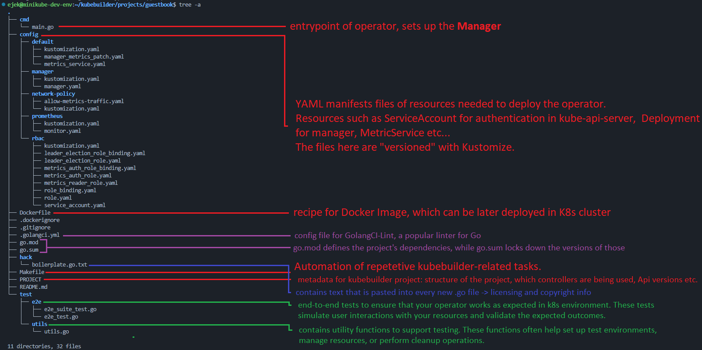
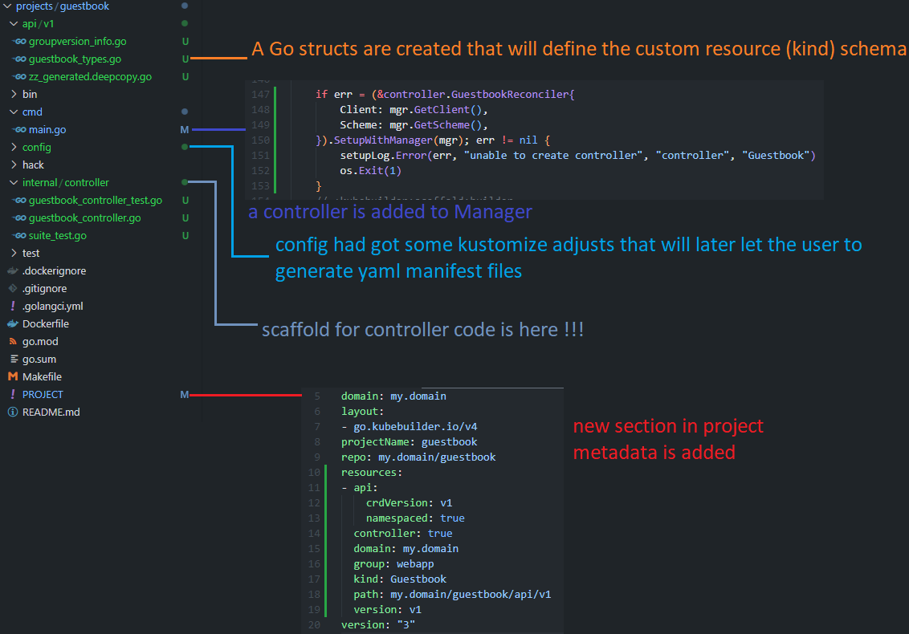

# Quick start
https://book.kubebuilder.io/quick-start

This Quick Start guide will cover:
- Creating a project -> setting up kubebuilder boilerplate code
- Creating an API -> [What does it mean](aux/creating-an-api.md)
- Running locally
- Running in-cluster

## Installation
```sh
# download kubebuilder and install locally.
curl -L -o kubebuilder "https://go.kubebuilder.io/dl/latest/$(go env GOOS)/$(go env GOARCH)"
chmod +x kubebuilder && sudo mv kubebuilder /usr/local/bin/
```
## Create a project
```sh
mkdir -p ~/projects/guestbook
cd ~/projects/guestbook
kubebuilder init --domain my.domain --repo my.domain/guestbook
```

It resulted with such directory/files structure:


For better understanding of `/config` directory go to -> [resources-needed-by-operator.md](aux/resources-needed-by-operator.md)

## Create an API

[What does it mean to create an API?](aux/creating-an-api.md)

```sh
kubebuilder create api --group webapp --version v1 --kind Guestbook
```

This will create new API group-version (`webapp/v1`) and the new kind `guestbook` in it.

> *Why do we have separate command for api creation and project initialization? bcuz we can have several apis = custom resources developed in a single project

> *Why are we creating a new api, not a new CRD? bcuz the ultimate goal is to extend our cluster's kube-api-server with new endpoints, and to code logic behind them

Ok let's run it!

kubebuilder asks us if to create a resource and controller, click yes so you will have a scaffolds for that

After this operation we've got some new files or changes in existing files in our project.



### api/v1
Our new kind Guestbook specifies several Go struct types. All of these are placed in [api/v1/guestbook_types.go](projects/guestbook/api/v1/guestbook_types.go).

This file is for us, developers to edit.

First we need to know the difference between the spec and status.

**spec** -> specification of an object. This is the DESIRED state of an object expressed in the yaml manifest file.

**status** -> status of an object. This is the CURRENT state of an object stored in etcd.


### internal controller

Here the file [guestbook_controller.go](projects/guestbook/internal/controller/guestbook_controller.go) is important.


Let's take a closer look at the reconcile function:
```go
func (r *GuestbookReconciler) Reconcile(ctx context.Context, req ctrl.Request) (ctrl.Result, error) {
	_ = log.FromContext(ctx)

	// TODO(user): your logic here

	return ctrl.Result{}, nil
}
```
Params:
- `context.Context` 
    - it is the generally-known thing in GO. Not a part of https://github.com/kubernetes-sigs/controller-runtime
    - more can be learned here: [context.md](context-tutorial.md)
    - In here, it allows for example the reconciliation to be terminated early if needed, such as in the case of a timeout or shutdown.
- `ctrl.Request`
    - contains the **namespaced name** of the resource that is being reconciled
    - it allows the reconciler to fetch the actual object from the K8s cluster (from the `kube-api-server`)
- 

Return type:
- `ctrl.Result`
    - This tells the controller-runtime framework wheter the reconcilliation loop shoulld be requeued (i.e. retried) and if so, after how long
    - if `ctrl.Result{Requeue: true}` is returned, it means the reconciliation should be requeued immediately.
    - if `ctrl.Result{RequeueAfter: <duration>}` is returned, it means the reconciliation should be requeued after a certain delay.
    - if `ctrl.Result{}` is returned without requeue, it means that no further action is necessary until another event occurs.
- `error`
    -  If an error is returned, the controller-runtime will log the error and requeue the request for reconciliation. This helps the controller continuously try to reach the desired state if an issue occurs.

Exemplary use:

```go
func (r *GuestbookReconciler) Reconcile(ctx context.Context, req ctrl.Request) (ctrl.Result, error) {
    // Fetch the Guestbook instance
    var guestbook webappv1.Guestbook
    if err := r.Get(ctx, req.NamespacedName, &guestbook); err != nil {
        if errors.IsNotFound(err) {
            // The resource may have been deleted, so we ignore the error
            // and return a successful result without requeueing.
            return ctrl.Result{}, nil
        }
        // If there's an error fetching the resource, requeue the request.
        return ctrl.Result{}, err
    }

    // Check the current state and reconcile
    if guestbook.Spec.Foo == "createSomething" {
        // Example: Creating a new resource if it doesn't exist
        newResource := &corev1.Pod{
            ObjectMeta: metav1.ObjectMeta{
                Name:      "example-pod",
                Namespace: req.Namespace,
            },
            Spec: corev1.PodSpec{
                Containers: []corev1.Container{
                    {
                        Name:  "busybox",
                        Image: "busybox",
                        Command: []string{"sleep", "3600"},
                    },
                },
            },
        }

        // Set Guestbook instance as the owner and controller of the new resource
        if err := ctrl.SetControllerReference(&guestbook, newResource, r.Scheme); err != nil {
            return ctrl.Result{}, err
        }

        // Create the new resource
        if err := r.Create(ctx, newResource); err != nil {
            if !errors.IsAlreadyExists(err) {
                return ctrl.Result{}, err
            }
        }
    }

    // Example: Update the status
    guestbook.Status.Phase = "Running"
    if err := r.Status().Update(ctx, &guestbook); err != nil {
        return ctrl.Result{}, err
    }

    // No need to requeue
    return ctrl.Result{}, nil
}
```

As you can see here we use the `r` variable which is the `GuestbookReconciler` itself.


Let's take a look at `GuestbookReconciler` class.

```go
// GuestbookReconciler reconciles a Guestbook object
type GuestbookReconciler struct {
	client.Client
	Scheme *runtime.Scheme
}
```

In go, if a field is not named it just indicates that this type can directly use method of the indicated interface type. This is the case with the `Client` field.<br>
`Scheme` on the other hand is a named field. `GuestbookReconciler` type has to store some data in this field. In this case, the scheme of GuestBook.

What methods does `GuestbookReconciler` inherits from `Client`?
```go
// Client knows how to perform CRUD operations on Kubernetes objects.
// via kube-api-server
type Client interface {
	Reader
	Writer
	StatusClient
	SubResourceClientConstructor

	// Scheme returns the scheme this client is using.
	Scheme() *runtime.Scheme
	// RESTMapper returns the rest this client is using.
	RESTMapper() meta.RESTMapper
	// GroupVersionKindFor returns the GroupVersionKind for the given object.
	GroupVersionKindFor(obj runtime.Object) (schema.GroupVersionKind, error)
	// IsObjectNamespaced returns true if the GroupVersionKind of the object is namespaced.
	IsObjectNamespaced(obj runtime.Object) (bool, error)
}

type Reader interface {
	// Get retrieves an obj for the given object key from the Kubernetes Cluster.
	// obj must be a struct pointer so that obj can be updated with the response
	// returned by the Server.
    // e.g. r.Get(ctx, req.NamespacedName, &guestbook)
	Get(ctx context.Context, key ObjectKey, obj Object, opts ...GetOption) error

	// List retrieves list of objects for a given namespace and list options. On a
	// successful call, Items field in the list will be populated with the
	// result returned from the server.
	List(ctx context.Context, list ObjectList, opts ...ListOption) error
}

// Writer knows how to create, delete, and update Kubernetes objects.
type Writer interface {
	// Create saves the object obj in the Kubernetes cluster. obj must be a
	// struct pointer so that obj can be updated with the content returned by the Server.
    // e.g. r.Create(ctx, newResource)
	Create(ctx context.Context, obj Object, opts ...CreateOption) error

	// Delete deletes the given obj from Kubernetes cluster.
	Delete(ctx context.Context, obj Object, opts ...DeleteOption) error

	// Update updates the given obj in the Kubernetes cluster. obj must be a
	// struct pointer so that obj can be updated with the content returned by the Server.
    // e.g. r.Status().Update(ctx, &guestbook)
	Update(ctx context.Context, obj Object, opts ...UpdateOption) error

	// Patch patches the given obj in the Kubernetes cluster. obj must be a
	// struct pointer so that obj can be updated with the content returned by the Server.
	Patch(ctx context.Context, obj Object, patch Patch, opts ...PatchOption) error

	// DeleteAllOf deletes all objects of the given type matching the given options.
	DeleteAllOf(ctx context.Context, obj Object, opts ...DeleteAllOfOption) error
}

// StatusClient knows how to create a client which can update status subresource
// for kubernetes objects.
type StatusClient interface {
	Status() SubResourceWriter // Above we have a writer, but this is SUB_RESOURCEwrite. The writer is for the resource (the big one) and SubResourceWriter is only for the part of resource (e.g. Status).
    // This is used specifically to modify the status field independently from the spec, adhering to Kubernetes' practice of separating desired and observed states.
}
```

## Create the CRD files

Ok, let's make some changes in `guestbook_types.go` so we can generate CRD manifest files.

These are the changes in `api/v1/guestbook_types.go`:


Now, let's run:

```sh
make manifests
```

A new directory `crd` appeared in `config` dir.


Check out the generated file: [webapp.my.domain_guestbooks.yaml](projects/guestbook/config/crd/bases/webapp.my.domain_guestbooks.yaml)

It defines a schema that will be sent to `kube-api-server` to register a new resource in your k8s cluster.

## Install your custom resource in a cluster
How to register a new resource? We need to run `kubectl apply -f <our_crd_file>`. Kubebuilder comes with predefined command for it in makefile. Just run:
```sh
make install
```


As you can see before `make install`, our cluster had no resource type "guestbooks". 

After `make install` it has one, but on objects/instances are found in default namespace.

## Make an object of your custom resource kind

Let's create some sample yaml object definition file of our newly regiester kind - "Guestbook".

```yaml
apiVersion: webapp.my.domain/v1
kind: Guestbook
metadata:
  name: adam
  namespace: default
spec:
  alias: Phone
  configMapName: adam-config
  size: 3
```

>* Kubebuilder already comes with sample file for us to fill. [It's here](projects/guestbook/config/samples/webapp_v1_guestbook.yaml)a

Save such file and run 
```sh
kubectl apply -f <file_name>.yaml
```


# Run the controller

To run the controller locally* just use:

```sh
make run
```
> *As a process on your terminal, not a deployed pod in a cluster.<br> Controller will still be able to communicate with kube-api-server, bcuz it reads it from kubectil config (this is what kubebuilder does for you)

Before the run, I've modified the reconcile function in controller code to log out every time Reconcilation Request comes in.

```go
func (r *GuestbookReconciler) Reconcile(ctx context.Context, req ctrl.Request) (ctrl.Result, error) {
	// Create a logger from the context
	logger := log.FromContext(ctx)

	// Log the creation of a new Guestbook resource
	logger.Info("Reconciling Guestbook resource", "namespace", req.Namespace, "name", req.Name)

	// Fetch the Guestbook instance
	var guestbook webappv1.Guestbook
	if err := r.Get(ctx, req.NamespacedName, &guestbook); err != nil {
		// If the resource is not found, it might have been deleted after the reconcile request.
		// In this case, just return without error.
		if errors.IsNotFound(err) {
			logger.Info("Guestbook resource not found. Ignoring since object must be deleted", "namespace", req.Namespace, "name", req.Name)
			return ctrl.Result{}, nil
		}
		// If an error occurred while fetching the resource, requeue the request
		logger.Error(err, "Failed to get Guestbook resource", "namespace", req.Namespace, "name", req.Name)
		return ctrl.Result{}, err
	}

	// TODO: Implement your reconciliation logic here

	return ctrl.Result{}, nil
}
```

