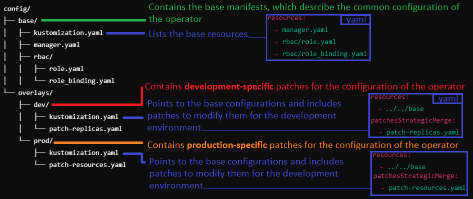
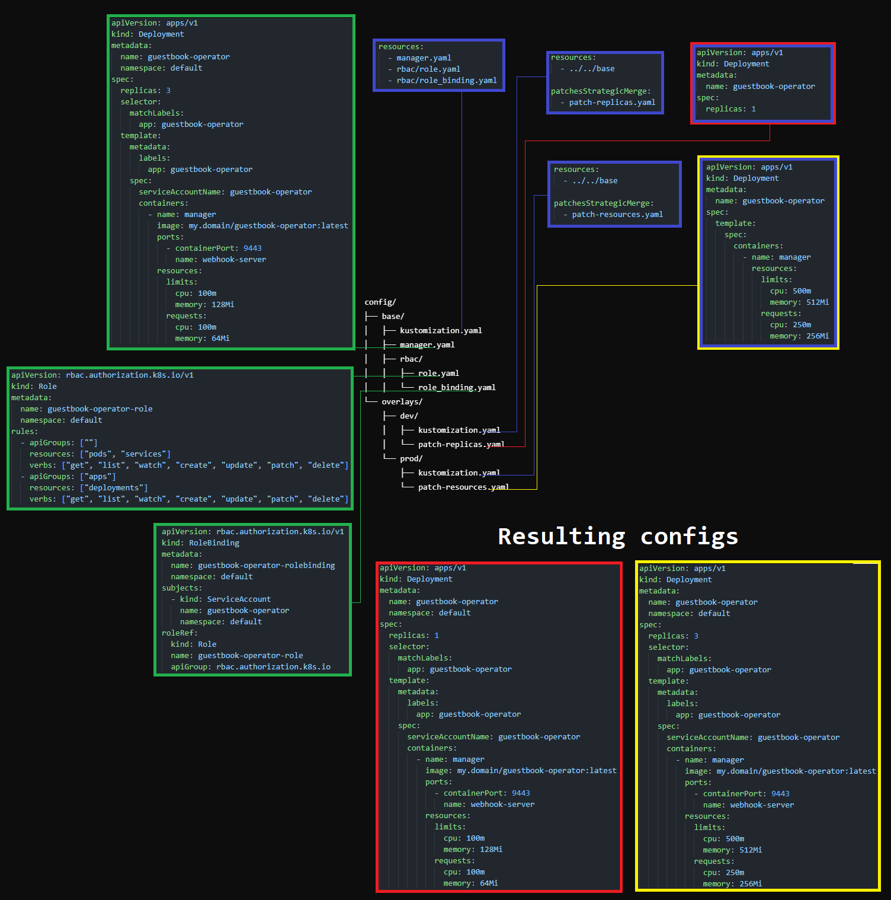

# Kubernetes manifest file

A Kubernetes manifest file is a YAML or JSON configuration file used to define and manage Kubernetes resources

These files describe the desired state of Kubernetes objects, such as Pods, Deployments, Services, Ingress, and other resources.

Example:
```yaml
apiVersion: apps/v1
kind: Deployment
metadata:
  name: nginx-deployment
  labels:
    app: nginx
spec:
  replicas: 3
  selector:
    matchLabels:
      app: nginx
  template:
    metadata:
      labels:
        app: nginx
    spec:
      containers:
      - name: nginx
        image: nginx:1.19.3
        ports:
        - containerPort: 80
```

# Resources needed to deploy the Operator
## 1st round
### Service Account
It provides an operator with an identity that is used for authentication during communicating with `kube-api-server`
### Roles and RoleBinding
These specify what actions (e.g. get, list, watch) the operator can perform on which Kubernetes resources.

E.g. a Pod-Controller needs persmission to create, update, delete and list Pods
### Deployment
The operator runs as a Deployment in the K8s cluster. This resource defines how many replicas of the controller should run, the container image, environment variables, resource* requests/limist etc.
> *like cpu,ram
### Netowrk Policies
Define which types of network traffic are allowed to reach the operator, such as allowing Prometheus to scrape metrics from the manager.

### Metrics Service
Defines a Service for exposing the metrics endpoint that Prometheus or another monitoring tool can use to scrape.

### Leader Election Resource 
The operator uses a mechanism called leader election to ensure that only one instance of the controller is active if multiple replicas are deployed. This prevents multiple instances from making conflicting changes.
## 2nd round
### ServiceAccount
https://kubernetes.io/docs/concepts/security/service-accounts/

```yaml
apiVersion: v1
kind: ServiceAccount
metadata:
  name: guestbook-operator
  namespace: default
```

### Roles and RoleBindings
https://kubernetes.io/docs/reference/access-authn-authz/rbac/


```yaml
apiVersion: rbac.authorization.k8s.io/v1
kind: Role
metadata:
  name: guestbook-operator-role
  namespace: default
rules:
  - apiGroups: [""]
    resources: ["pods", "services"]
    verbs: ["get", "list", "watch", "create", "update", "patch", "delete"]
  - apiGroups: ["apps"]
    resources: ["deployments"]
    verbs: ["get", "list", "watch", "create", "update", "patch", "delete"]
```
```yaml
apiVersion: rbac.authorization.k8s.io/v1
kind: ClusterRole
metadata:
  name: guestbook-operator-cluster-role
rules:
  - apiGroups: [""]
    resources: ["nodes"]
    verbs: ["get", "list", "watch"]
  - apiGroups: ["apps"]
    resources: ["replicasets"]
    verbs: ["get", "list", "watch", "create", "update", "patch", "delete"]
```
```yaml
apiVersion: rbac.authorization.k8s.io/v1
kind: RoleBinding
metadata:
  name: guestbook-operator-rolebinding
  namespace: default
subjects:
  - kind: ServiceAccount
    name: guestbook-operator
    namespace: default
roleRef:
  kind: Role
  name: guestbook-operator-role
  apiGroup: rbac.authorization.k8s.io
```
```yaml
apiVersion: rbac.authorization.k8s.io/v1
kind: ClusterRoleBinding
metadata:
  name: guestbook-operator-clusterrolebinding
subjects:
  - kind: ServiceAccount
    name: guestbook-operator
    namespace: default
roleRef:
  kind: ClusterRole
  name: guestbook-operator-cluster-role
  apiGroup: rbac.authorization.k8s.io
```

### Deployment
```yaml
apiVersion: apps/v1
kind: Deployment
metadata:
  name: guestbook-operator
  namespace: default
spec:
  replicas: 1
  selector:
    matchLabels:
      name: guestbook-operator
  template:
    metadata:
      labels:
        name: guestbook-operator
    spec:
      serviceAccountName: guestbook-operator
      containers:
        - name: manager
          image: my.domain/guestbook-operator:latest
          command:
            - /manager
          ports:
            - containerPort: 9443
              name: webhook-server
      resources:
        limits:
          cpu: 100m
          memory: 128Mi
        requests:
          cpu: 100m
          memory: 64Mi
```
### Network Policy
```yaml
apiVersion: networking.k8s.io/v1
kind: NetworkPolicy
metadata:
  name: allow-metrics-traffic
  namespace: default
spec:
  podSelector:
    matchLabels:
      name: guestbook-operator
  policyTypes:
    - Ingress
  ingress:
    - from:
        - namespaceSelector: {}
          podSelector: {}
      ports:
        - protocol: TCP
          port: 8080
```
### Metrics Service
```yaml
apiVersion: v1
kind: Service
metadata:
  name: guestbook-operator-metrics-service
  namespace: default
  labels:
    name: guestbook-operator
spec:
  ports:
    - port: 8080
      name: http-metrics
  selector:
    name: guestbook-operator
  type: ClusterIP
```
### Leader election role and role binding
```yaml
apiVersion: rbac.authorization.k8s.io/v1
kind: Role
metadata:
  name: guestbook-operator-leader-election-role
  namespace: default
rules:
  - apiGroups: [""]
    resources: ["configmaps"]
    verbs: ["create", "get", "update", "delete"]
```
```yaml
apiVersion: rbac.authorization.k8s.io/v1
kind: RoleBinding
metadata:
  name: guestbook-operator-leader-election-rolebinding
  namespace: default
subjects:
  - kind: ServiceAccount
    name: guestbook-operator
    namespace: default
roleRef:
  kind: Role
  name: guestbook-operator-leader-election-role
  apiGroup: rbac.authorization.k8s.io
```

## Summary 
To deploy a Kubebuilder-based operator, you need a variety of Kubernetes resources, each serving an unique role:

- ServiceAccount: Identity for operator communication with `kube-api-server`
- Role/ClusterRole and RoleBinding/ClusterRoleBinding: Define and assign permissions for operators.
- Deployment: Deploys and manages the operator's Pods.
- NetworkPolicy (optional): Controls access to the operator for security purposes.
- Metrics Service (optional): Exposes metrics for monitoring.
- Leader Election Role and RoleBinding: Manages leader election in case of HA.

These resources together ensure that the operator runs effectively, has the permissions it needs, and integrates well into the Kubernetes environment.

# Kustomize

In the operator world, you often need to deploy the operator to different environments like development, testing, and production. These environments might need different configurations, such as resource limits, number of replicas, or the logging level. Kustomize allows you to create and manage different overlays for each environment without modifying the base configurations.

## Example
Let's consider a situation where you're deploying an operator that manages a custom resource called Guestbook. You need to create different configurations for development and production environments.



Let's assume in our example that:
- In development mode only 1 replica will be needed, not 3
- In production mode we require more performencable cpu/ram resources



